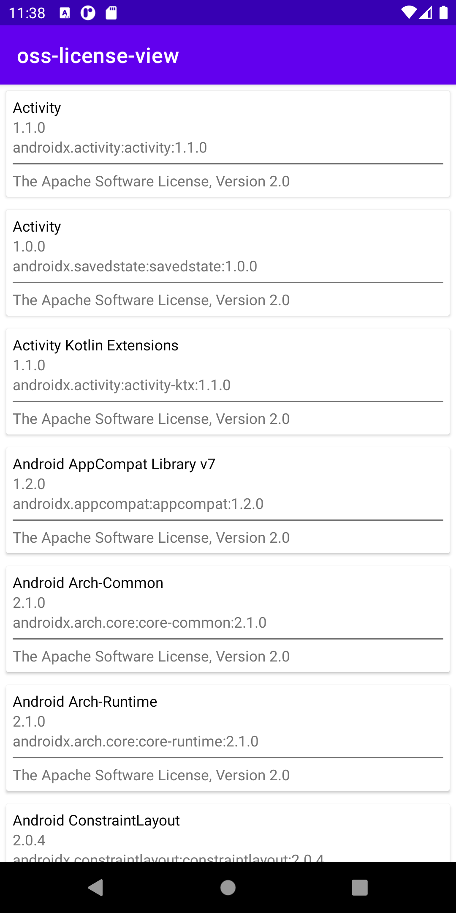

# OssLicenseView
A android view for open source Licenses.

[](https://jitpack.io/#leonlatsch/OssLicenseView)


# Getting Started

This library uses the json report file from [jaredsburrows/gradle-license-plugin](https://github.com/jaredsburrows/gradle-license-plugin)!

#### Step 1 - Integrate the report plugin

- Apply the [jaredsburrows/gradle-license-plugin](https://github.com/jaredsburrows/gradle-license-plugin) plugin in your app's `build.gradle` file.
- Configure the plugin to copy the json report to the assets folder.
  
```gradle
apply plugin: "com.jaredsburrows.license"

licenseReport {
  generateCsvReport = false
  generateHtmlReport = false
  generateJsonReport = true
  
  copyHtmlReportToAssets = false
  copyHtmlReportToAssets = false
  copyJsonReportToAssets = true
}
```
This will generate a json report of your dependencies like [this](app/src/main/assets/licenseReleaseReport.json)

#### Step 2 - Use the report with this library

- Add this dependency:
```gradle
allprojects {
    repositories {
        ...
        maven { url 'https://jitpack.io' }
    }
}
```
```gradle
implementation 'com.github.leonlatsch:OssLicenseView:$VERSION'
```

- Create a new OssLicenseView
```xml
<dev.leonlatsch.osslicenseview.OssLicenseView
        android:id="@+id/ossRecyclerView"
        android:layout_width="match_parent"
        android:layout_height="match_parent" />
```

- Initialize the new view with your json report
```kotlin
val ossRecyclerView = findViewById<OssLicenseView>(R.id.ossRecyclerView)
ossRecyclerView.initialize("licenseReleaseReport.json") // The file will most likely be named like that, if you don't change it.
```

## Thats it!
It will display like this.



# Other

This library is used in my app [Photok](https://github.com/leonlatsch/Photok).

LICENSE
=======
    Copyright 2021 Leon Latsch

    Licensed under the Apache License, Version 2.0 (the "License");
    you may not use this file except in compliance with the License.
    You may obtain a copy of the License at

        http://www.apache.org/licenses/LICENSE-2.0

    Unless required by applicable law or agreed to in writing, software
    distributed under the License is distributed on an "AS IS" BASIS,
    WITHOUT WARRANTIES OR CONDITIONS OF ANY KIND, either express or implied.
    See the License for the specific language governing permissions and
    limitations under the License.==
